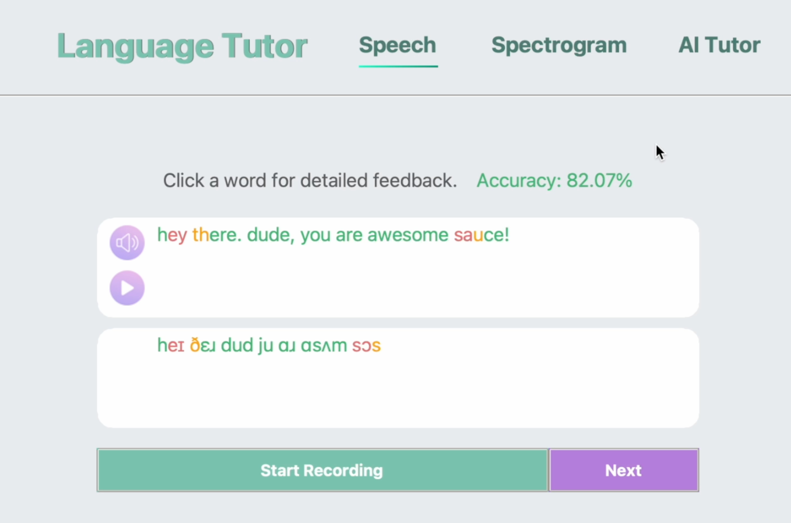

# jaide - AI Language Tutor
_An AI tool to help improve English pronunciation and grammar (Yes I named it after myself)._

Grades spoken english by
- converting recordings into phonetic transcriptions
- carrying out sequence allignment to identify mispronounciations
- scoring based on severity of mispronounciations

Includes a rule-based chatbot to simulate conversation while providing spoken-grammar tips.

This project is WIP. It's done local and uses heavy AI models for Speech to text and determining grammatical errors. Clone at your own risk

pip install -r requirements.txt

